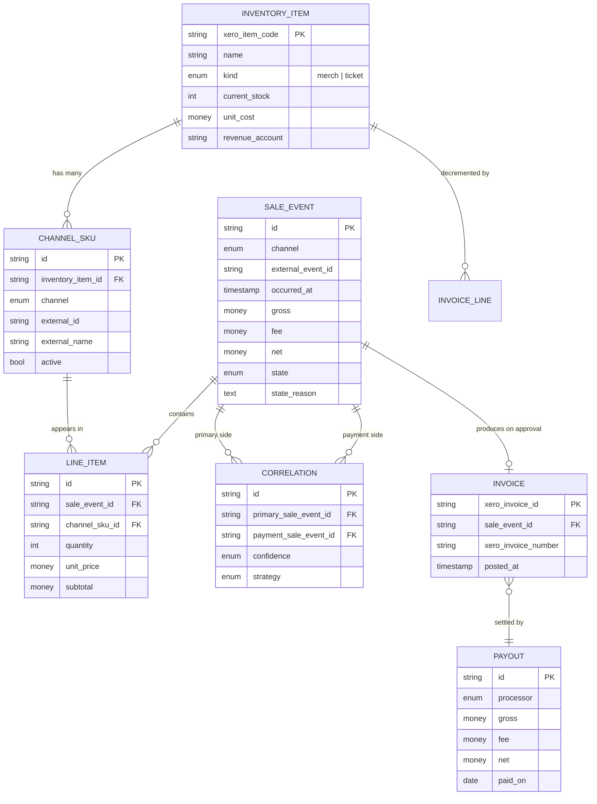
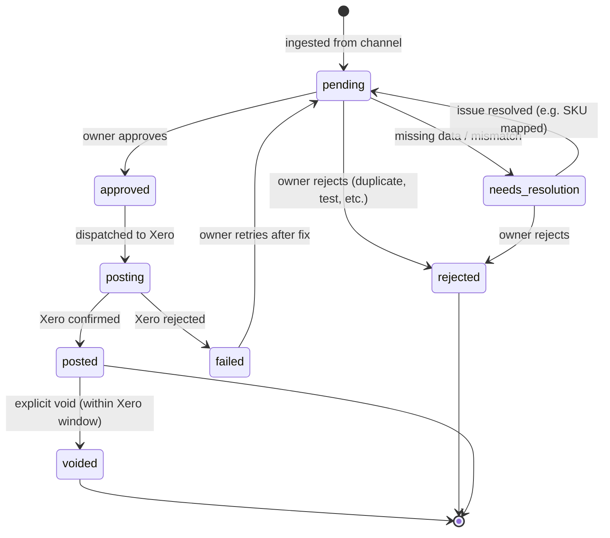

> **Document Version: 0.2** | 2026-05-22
>
> Draft for owner review. The vocabulary, entities, and business rules below are the contract this system is built around. Sign-off here precedes any work on the solution proposal.
>
> **Changed in v0.2:** corrections driven by the integration research under `docs/integrations/*.md`. The model's shape and vocabulary are unchanged. Notable corrections: §4.2 Line Item invariant (the channel that needs line-item enrichment is **Squarespace**, not TicketTailor), §4.2 Sale Event fee note (Stripe fees arrive via a separate object), §8 open-scope questions updated with current status. Specific changes are tagged `[v0.2]`.

## 1. Purpose

This document defines the shared language and rules of the LBK inventory + sales reconciliation system. It is the source of truth for **what we mean** when we say things like "sale event", "reconciliation", or "inventory item" — independent of how those concepts are implemented.

Two audiences:

- **The owner**, who will use the resulting system and needs the vocabulary to match how the business actually operates.
- **Anyone building or extending the system**, who needs unambiguous definitions for the entities and rules they will encode.

If a term in this document conflicts with how the owner uses it day-to-day, the owner's usage wins and this document gets updated. The point of the model is to reflect reality, not the other way around.

## 2. Context

LBK sells across four channels:

| Channel | Sells | Payment processor |
|---|---|---|
| Squarespace online store | Physical merchandise | Stripe |
| TicketTailor | Event admission (ticket types) | Stripe |
| Square (in-person at events) | Physical merchandise, possibly door-sale tickets | Square |
| Direct / other | (out of scope for v1) | (n/a) |

Accounting lives in Xero. Today, Xero receives bank-feed data from Stripe and Square via Xero's **official direct feed integrations** (a "Stripe direct feed" virtual bank account that mirrors every charge/fee/refund/payout; a Square integration that posts daily summaries as bank transactions). The feeds give Xero deposits and totals but no itemized detail. This means LBK cannot answer "how many Adult Passes did we sell at the convention last weekend" or "how much revenue came from t-shirts vs books last month" from Xero alone.

This system bridges that gap: it captures per-item sale data from every channel and posts itemized invoices to Xero, decrementing tracked inventory at the same time. **[v0.2] Critical positioning:** lbkmk's job is to publish itemized Invoices that the existing Stripe/Square bank-feed deposits then **clear** via Xero's "Find & Match" — not to ingest the deposits itself. Posting Invoices while a bank rule also auto-categorises feed deposits as revenue would double-count the books. The exact configuration of those bank rules in LBK's Xero tenant is the load-bearing open question (§8).

## 3. Glossary

The following terms have **one specific meaning** in this system.

| Term | Definition |
|---|---|
| **Channel** | An external system where LBK sells. Currently: Squarespace, Stripe, Square, TicketTailor. (Stripe is both a sales channel _and_ a payment processor — see Sale Event.) |
| **Sale Event** | A single record of something happening in a channel — an order placed, a charge processed, a ticket bought. Every event has a channel of origin, an external ID, a timestamp, and a money amount. Some sale events also have line items. |
| **Line Item** | A single sellable thing within a Sale Event: "1 × Adult Pass at $35" or "2 × LBK T-shirt (red, L) at $25". A Sale Event MAY have zero or more Line Items. |
| **Inventory Item** | A canonical sellable thing tracked in Xero with a quantity-on-hand. Examples: "Adult Pass — Spring Convention 2026", "LBK T-shirt (red, large)", "Picture book: The Big Adventure". Xero is the source of truth for stock levels and accounting. |
| **Channel SKU** | A mapping between how a channel identifies a product (e.g. Squarespace variant ID `var_abc123`, TicketTailor ticket type ID `tt_456`, Square catalog item ID `sq_789`) and the canonical Inventory Item in Xero. A single Inventory Item may have many Channel SKUs across channels. |
| **Correlation** | A pairing between two Sale Events that describe the same underlying business transaction. Example: a Squarespace **order** (sale side) and the Stripe **charge** that paid for it (payment side). |
| **Reconciliation** | The family of comparisons that confirm what we recorded matches what actually happened. The four specific kinds — their sides, source systems, triggers, and success criteria — are catalogued in `solution-proposal.md` §6 ("Reconciliation Catalog"). The cadence on which each kind runs (continuous vs daily) is described in `solution-proposal.md` §7. |
| **Reconciliation State** | The lifecycle position of a Sale Event: where it is in the path from "just arrived" to "posted to Xero". See §5. |
| **Approval** | The human action by which the owner confirms that a Sale Event is correctly captured and authorizes it to be posted to Xero. Approval is irreversible in the sense that an approved-and-posted event must be reversed via an explicit void, not by editing or deleting the original. |
| **Invoice** | The Xero document we create from an approved Sale Event. It carries the itemized lines, the payment reference, and the total. Posting an Invoice in Xero automatically decrements tracked Inventory Items and records the revenue against the right accounts. |
| **Payout** | A bank deposit from a payment processor (Stripe, Square) into LBK's bank account, representing the net of many individual charges minus fees, over some period. Today, these arrive in Xero via existing bank feeds. |
| **Bank Feed** | An existing Xero integration that pulls Stripe and Square payouts into Xero as bank transactions. This system does **not** replace the bank feed; it complements it by providing the itemized invoices that the bank feed deposits should reconcile against. |
| **Drift** | A discrepancy between the sum of approved Invoices for a period and the corresponding Payout total. Drift is surfaced for review, not auto-resolved. |
| **Audit Log** | An append-only record of every state transition and every external write (especially to Xero). Forensic-quality: we can always answer "who did what when, and what did the external system say back". |

## 4. Core Entities

### 4.1 Entity overview

### 4.2 Entity definitions

Each section gives: **purpose**, **identity**, **key attributes**, **lifecycle** (if applicable), and **invariants** (rules that must always hold true).

#### Inventory Item

- **Purpose:** The canonical sellable thing. Xero owns the stock count; this system mirrors it.
- **Identity:** Xero item code (e.g. `TSHIRT-RED-L`, `TICKET-SPRING2026-ADULT`).
- **Key attributes:** name, kind (`merch` or `ticket`), current stock (cached from Xero), unit cost, revenue account code.
- **Lifecycle:** Created in Xero (manually or via an onboarding script), mirrored here. Retirement is soft — items stay for historic reference.
- **Invariants:**
  - An Inventory Item exists in this system only if it exists in Xero.
  - Stock count in this system reflects the most recent Xero snapshot; it is a read-model, never written to directly.
  - `kind` determines accounting treatment: `merch` decrements physical stock; `ticket` decrements an event-specific quantity cap (still tracked as Xero inventory but conceptually time-bounded).

#### Channel SKU

- **Purpose:** Bridge between a channel's identifier for a product and the canonical Inventory Item.
- **Identity:** `(channel, external_id)` is unique. The pair `(Stripe, sq_789)` and `(Square, sq_789)` are different Channel SKUs.
- **Key attributes:** channel, external id, external name (for human readability), pointer to Inventory Item, active flag.
- **Lifecycle:** `unmapped` (system saw an unknown external id and parked it) → `mapped & active` (owner picked the right Inventory Item) → `retired` (no longer in use; kept for history).
- **Invariants:**
  - Every Line Item references exactly one Channel SKU.
  - A Channel SKU in `unmapped` state cannot resolve a Line Item; events using it route to `needs_resolution` until mapped.
  - A retired Channel SKU may not be selected for new mappings but remains for historical Sale Events.

#### Sale Event

- **Purpose:** A single record of channel activity — the universal input shape.
- **Identity:** `(channel, external_event_id)` is unique. Re-delivery of the same source event is absorbed.
- **Key attributes:** channel, external event ID, occurred-at timestamp, gross / fee / net amount, currency, raw payload (kept verbatim for forensics), reconciliation state, state reason.
- **[v0.2] Fee semantics by channel:** the gross / fee / net triple comes pre-computed for most channels (TicketTailor, Square include fee in the order/payment payload). **Stripe is the exception:** the processing fee lives on a linked `balance_transaction` object, not on the `Charge` itself — the Stripe ingress scenario must fetch / expand `balance_transaction` to populate `fee`. Without that step, Stripe-side Sale Events have `fee = NULL` and the §6 per-payout reconciliation math breaks.
- **[v0.2] Raw payload protection:** the raw payload may contain PII — Stripe and Squarespace bodies carry `card.last4`, billing name, postcode, sometimes address. We never see PAN/CVC, but the combination is identifying. Raw payload columns must be **encrypted at rest** and access-controlled to ingest + audit roles only; routine reporting must read normalized columns.
- **Lifecycle:** See §5.
- **Invariants:**
  - A Sale Event cannot be deleted. Mistakes are corrected by transitioning state (e.g. to `rejected`), never by removal.
  - A Sale Event in state `approved` or later is immutable except via explicit void.
  - The raw payload is never altered after first persistence.

#### Line Item

- **Purpose:** What was actually sold in a Sale Event, item-by-item.
- **Identity:** synthetic id; ordered by `line_index` within the parent Sale Event.
- **Key attributes:** quantity, unit price, subtotal, tax, channel SKU reference.
- **Lifecycle:** Owned by the parent Sale Event; no independent lifecycle.
- **Invariants:**
  - Sum of Line Item subtotals (+ tax + adjustments) must equal the Sale Event's gross. A mismatch sends the Sale Event to `needs_resolution`.
  - A Line Item without a resolved Channel SKU cannot be approved.
  - **[v0.2] Per-channel line-item availability (correction):** **Squarespace** webhooks deliver only `{ orderId }` and require `GET /1.0/commerce/orders/{id}` enrichment to populate Line Items — *not* TicketTailor as the v0.1 draft speculated. TicketTailor's `order.created` webhook ships the full `line_items[]` and `issued_tickets[]` natively. Square's webhook line-item presence is unconfirmed (issue #40) — design for re-fetch. Stripe direct-channel sales originate from Stripe Checkout where the Session carries line items. Net: Squarespace ingestion always enriches; TicketTailor never needs to; Square sometimes will; Stripe rarely. See `docs/integrations/{squarespace,tickettailor,square,stripe}.md`.

#### Correlation

- **Purpose:** Pair two Sale Events that describe the same business transaction across channels — typically a sale-side event (Squarespace order, TicketTailor order) and its payment-side event (the Stripe charge).
- **Identity:** synthetic id; unique on `(primary_sale_event_id, payment_sale_event_id)`.
- **Key attributes:** confidence (`high`, `medium`, `low`), match strategy (`id_match`, `metadata_match`, `amount_time_window`).
- **Lifecycle:** Created when match found; updated only if confidence/strategy changes.
- **[v0.2] Per-channel strategy reality:**
  - **Squarespace ↔ Stripe** is **deterministic via the forward direction**: Squarespace's Transactions API publishes the Stripe `ch_...` (`payments[].externalTransactionId`). lbkmk's Squarespace ingestion captures this at enrichment time and stores it on the Sale Event; `id_match` succeeds when the Stripe `charge.succeeded` arrives. The **reverse direction** (Stripe carrying the Squarespace order id in `Charge.metadata`) is not guaranteed and must not be relied on.
  - **TicketTailor ↔ Stripe** has a **candidate** deterministic path: TicketTailor's webhook `payment_method.external_id` *probably* contains the Stripe `ch_...` or `pi_...` when Stripe is the processor, but this is unverified against a live LBK order (issues #3, #29). Until confirmed, TicketTailor ↔ Stripe falls through to `amount_time_window` with `confidence: medium`, routing to `needs_resolution` for owner confirmation.
  - **Square** self-correlates: sale-side and payment-side come from Square in the same event scope. No Correlation row needed.
  - **Stripe direct** (Checkout) self-correlates: the Session carries the PaymentIntent / Charge link directly.
- **Invariants:**
  - A given Sale Event may appear as primary in at most one Correlation, and as payment in at most one Correlation.
  - Square sale events self-correlate (the sale and the charge are one event from Square's side) — no Correlation row needed.
  - A Correlation with `confidence: low` does not auto-approve; the owner reviews and confirms.

#### Invoice

- **Purpose:** The Xero output created by approving a Sale Event.
- **Identity:** Xero invoice ID (assigned by Xero on creation).
- **Key attributes:** Xero invoice number, line items mirroring the Sale Event's Line Items, payment reference back to the Sale Event id, posted-at timestamp.
- **Lifecycle:** `posting` (in flight to Xero) → `posted` (Xero confirmed) → optionally `voided` (explicit reversal).
- **Invariants:**
  - At most one Invoice exists per Sale Event (idempotent on the Xero side via the `Reference` field).
  - Voiding an Invoice marks the originating Sale Event as `posted` but flags it as `voided`; the Sale Event stays in history but cannot be re-approved without explicit re-instatement.

#### Payout

- **Purpose:** A bank deposit from Stripe or Square representing a settlement of many charges.
- **Identity:** processor + processor's payout id.
- **Key attributes:** processor, gross, fee, net, paid-on date, list of constituent Sale Events (the charges that summed into this payout).
- **Lifecycle:** `received` (we know about it) → `reconciled` (mapped to a set of approved Invoices) → `drift_flagged` (sums don't match within tolerance — this is the failure state of catalog kind 4 in `solution-proposal.md` §6).
- **Invariants:**
  - A Payout's gross should equal the sum of net amounts of the Sale Events it settles (within a small tolerance for rounding).
  - Drift is surfaced for owner review; the system never auto-resolves it.

#### Audit Log entry

- **Purpose:** Forensic trail of every state transition and every external write.
- **Identity:** synthetic id; append-only.
- **Key attributes:** actor type (`system` or `user`), actor id, subject type and id, action, metadata (payload, response, etc.), occurred-at.
- **Lifecycle:** Write-once.
- **Invariants:**
  - Never updated, never deleted (enforced at the database role / permissions layer).
  - Every state transition on a Sale Event commits with its corresponding Audit Log entry in a single transaction.

## 5. Sale Event Lifecycle

The states a Sale Event can be in, and the legal transitions between them.

**State definitions:**

- **`pending`** — Ingested and parsed; lines resolved; correlations attempted. Ready for owner action.
- **`needs_resolution`** — Cannot proceed without human input. Reason is recorded (unmapped SKU, no payment correlation found, amount mismatch, etc.).
- **`approved`** — Owner has clicked approve. Queued for posting to Xero.
- **`posting`** — In flight to Xero (transient — typically seconds).
- **`posted`** — Xero confirmed. Invoice exists. Inventory decremented.
- **`failed`** — Xero rejected the post. Reason is recorded; owner can retry after fixing the underlying issue.
- **`rejected`** — Owner explicitly rejected (e.g. test transaction, known duplicate from a webhook double-fire).
- **`voided`** — Posted invoice has been voided in Xero via this system.

**Why state `posted` is terminal-ish:** any further reversal must go through `voided`, never back through `pending`. This protects audit integrity — every observed change in Xero has a traceable cause.

## 6. Business Rules

These are the non-negotiable rules the system enforces. They override convenience and override "the channel sent us this, so it must be right".

### Reconciliation rules

(See the Reconciliation Catalog in `solution-proposal.md` §6 for the four kinds these rules govern. The "(kind N)" tags below point at the corresponding catalog row.)

1. **A Sale Event without resolved Line Items is not approvable.** Every Line Item must point to an active Channel SKU pointing to an Inventory Item. *(Precondition for kinds 2 and 3 — without resolved lines, neither the internal sum check nor the Xero invoice post can run.)*
2. **A Sale Event without a payment-side correlation is `needs_resolution`** — except for Square events, which self-correlate. *(Governs kind 1.)*
3. **A Sale Event whose Line Items don't sum to the gross is `needs_resolution`**, with a tolerance of $0.50 to absorb rounding and small fee anomalies. *(Governs kind 2.)*
4. **Approval is a deliberate, human-only act.** No event auto-approves, even with high confidence and clean data. The system can pre-clear an event (move it to `pending` and surface it as "ready") but cannot post on the owner's behalf. *(Governs the trigger of kind 3.)*

### Inventory rules

5. **Xero is the only writer of inventory counts.** This system never writes stock levels directly; it does so only as a side-effect of posting an Invoice.
6. **Inventory snapshots are read-only mirrors**, refreshed on a schedule. Stale snapshots are acceptable; conflicting writes are not.
7. **Tickets are inventory.** A ticket type is a tracked Inventory Item with `kind = ticket` and a finite stock equal to the event's capacity. Selling a ticket decrements stock the same way selling a t-shirt does.

### Channel SKU rules

8. **Unknown SKUs auto-park.** When a Sale Event arrives with a Channel SKU not in our mapping, we create a `Channel SKU` record in `unmapped` state and route the Sale Event to `needs_resolution`. The owner maps it once; all parked events with that SKU auto-resolve.
9. **A Channel SKU may map to exactly one Inventory Item.** No fan-out, no fan-in.
10. **Retiring a Channel SKU does not affect historic Sale Events.** Past events keep their original mapping.

### Audit rules

11. **Every state transition is logged.** No silent transitions.
12. **Every Xero call is logged in full** — request payload sent, response received, status. We can always answer "what exactly did we send and what did Xero say".
13. **Audit log entries are immutable.** Database-level enforcement, not just convention.

### Integration rules

14. **The dashboard never talks to Squarespace, Stripe, Square, TicketTailor, or Xero directly.** All external API access is mediated by Make scenarios. **[v0.2] Design rule, not invariant:** Xero is the candidate exception — for a single direct outbound integration with no per-call transformation, Make adds little beyond credential storage. `docs/integrations/xero.md` documents the direct-OAuth path. v1 keeps the Make-mediated shape for consistency; revisit if the Make Xero connector becomes a constraint.
15. **Make never holds business state.** Make scenarios are stateless transformers; this system is the source of truth for everything except the raw external data living in the source systems and in Xero.
16. **Re-delivery of any external event is harmless.** Ingestion is idempotent on `(channel, external_event_id)`.

## 7. Open vocabulary questions (for owner review)

These are terms where we want the owner to weigh in before locking the vocabulary:

- **"Approval"** — does this language match how the owner thinks about the act of signing off on a sale, or is there a better word (e.g. "confirm", "post", "release")?
- **"Drift"** — currently means a mismatch between approved invoices and a payout total. The owner may have an existing term for this.
- **"Channel SKU"** — works for the engineering side, but may be too jargon-heavy for owner-facing UI labels. Possible alternatives: "channel product mapping", "external product id".

*(Resolved 2026-05-22 from LBK feedback: "reconciliation" is the term of art; "matching" and "reconciling" are not used. See `solution-proposal.md` §6.)*

## 8. Open scope questions (for owner review)

**[v0.2] Status update:** integration research resolved one of the original four questions and surfaced four new ones the owner needs to weigh in on. Each item below tags its current status and (where applicable) cites the GitHub issue tracking the empirical follow-up. Issues #2–#64 are the full tier-2 research backlog.

### Resolved

- ~~**TicketTailor line items**~~ — **Resolved (affirmative).** `order.created` and `order.updated` webhooks ship full `line_items[]` + `issued_tickets[]`. No enrichment call needed. See `docs/integrations/tickettailor.md`.

### Still open — blocking (must close before implementation starts)

- **Existing Xero state and bank rules** *(issue #51)*. Strong evidence that LBK has Stripe and Square already connected via Xero's official direct feeds. The load-bearing detail is the **bank-rule configuration** in LBK's Xero tenant — if a rule auto-categorises feed deposits as revenue while lbkmk also posts revenue-crediting Invoices, the books double. lbkmk's posting strategy (`ACCREC AUTHORISED` invoices cleared by feed deposits via "Find & Match") depends on the answer.
- **Event-specific ticket caps** *(issue #53)*. Recommendation: per-event Inventory Items (clear stock semantics, clean historical reporting), with Item codes like `TICKET-SPRING2026-ADULT`. The alternative (shared "Adult Pass" Item reused across events) loses per-event stock caps. Confirm before locking the model.
- **LBK Xero plan tier** *(issue #55)*. Tracked inventory requires Standard+; multi-currency requires Premium. If LBK is on a lower tier the Item-based catalog approach breaks.
- **Chart-of-accounts mapping** *(issue #56)*. Which Account Code does each Inventory Item kind post to? Merch → one account; Tickets → another? Stripe fees → one account; Square fees → another?

### Still open — non-blocking (design accommodates either answer)

- **Per-customer vs umbrella Xero Contact strategy** *(issue #52)*. Recommendation: one umbrella Contact per channel. Per-customer requires Contact resolution + GDPR deletion path and explodes the Contacts list. Owner conversation: is per-customer reporting needed in v1?
- **Refund / return flow** — out of scope for v1, but `docs/integrations/{stripe,squarespace,square,tickettailor,xero}.md` already document the per-channel refund event shapes. v2 design can reference those directly; no fresh research needed. Owner's current manual refund workflow worth capturing now so v2 doesn't surprise them *(issue #54)*.
- **TicketTailor ↔ Stripe deterministic correlation** *(issues #3, #29)*. Empirical test against one real LBK TicketTailor-originated Stripe charge — 15-minute resolution. Affirmative answer upgrades most TicketTailor sales from `confidence: medium` to `confidence: high` and removes the owner-prompt step.
- **LBK Stripe account configuration** *(issues #27, #34)*. Confirms whether Squarespace and TicketTailor charges land in LBK's own Stripe Dashboard (merchant-of-record assumption) or under a Connect-platform account (different event delivery story).

The vocabulary alignment questions in §7 are unchanged and remain blocking on owner review independently.

## 9. Glossary alignment with owner's vocabulary

(To be filled in during owner review — capture the owner's preferred term for each glossary item, and update the glossary if they diverge.)

| Our term | Owner's term | Notes |
|---|---|---|
| Sale Event | _(tbd)_ | |
| Channel | _(tbd)_ | |
| Channel SKU | _(tbd)_ | |
| Reconciliation | _(tbd)_ | |
| Approval | _(tbd)_ | |
| Drift | _(tbd)_ | |
| Payout | _(tbd)_ | |
| Bank Feed | _(tbd)_ | |
