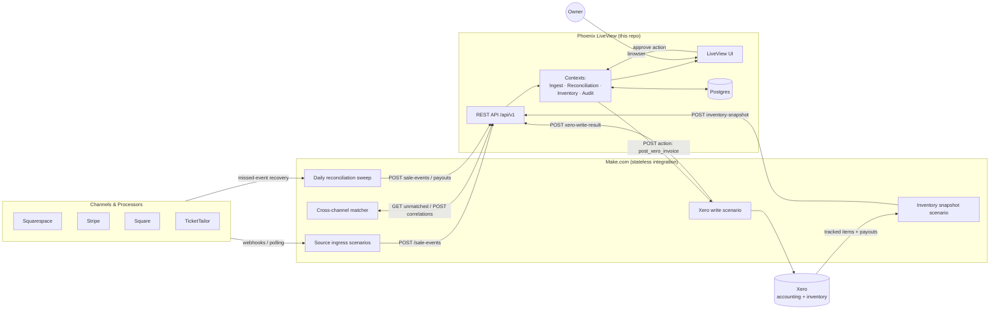
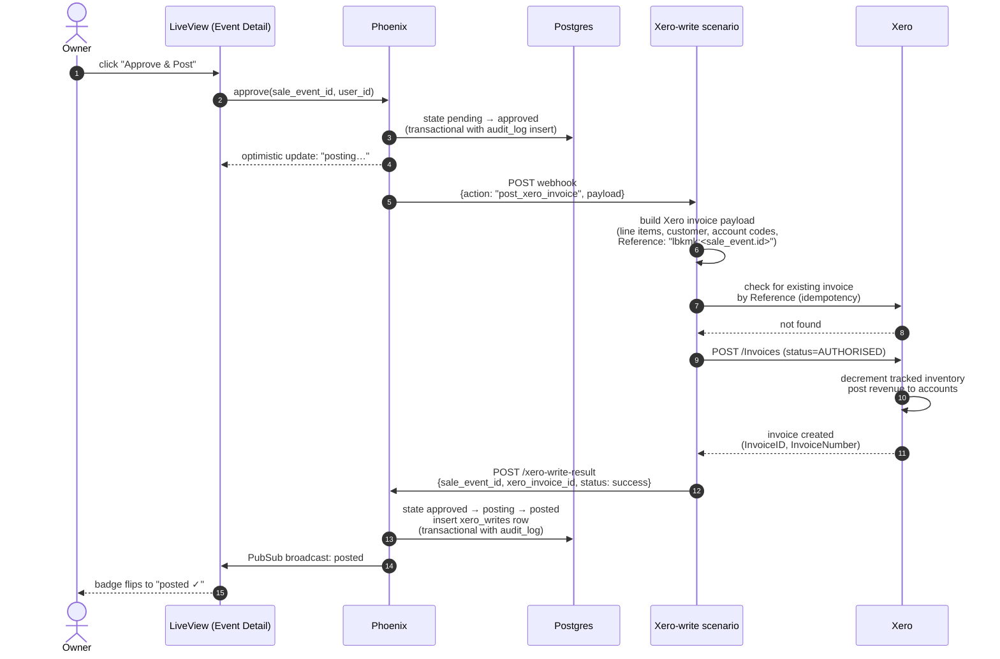
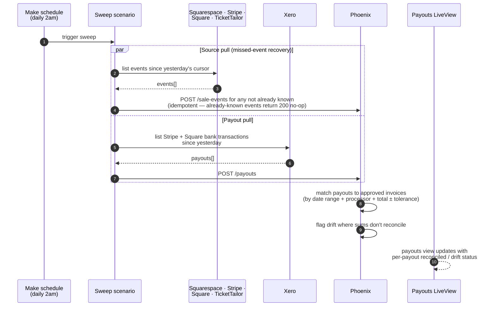
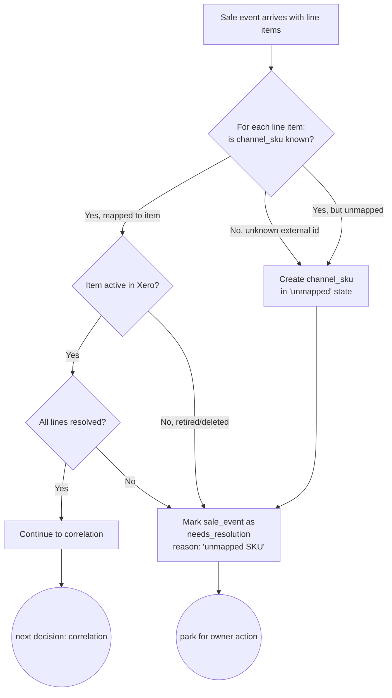
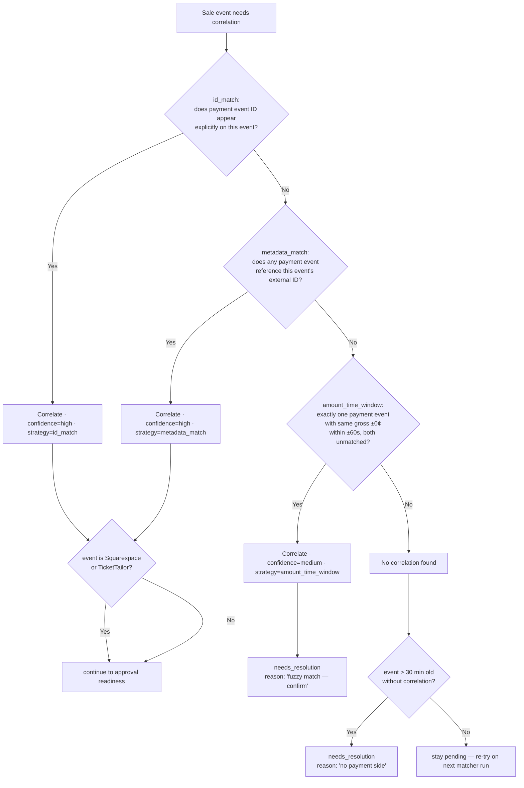
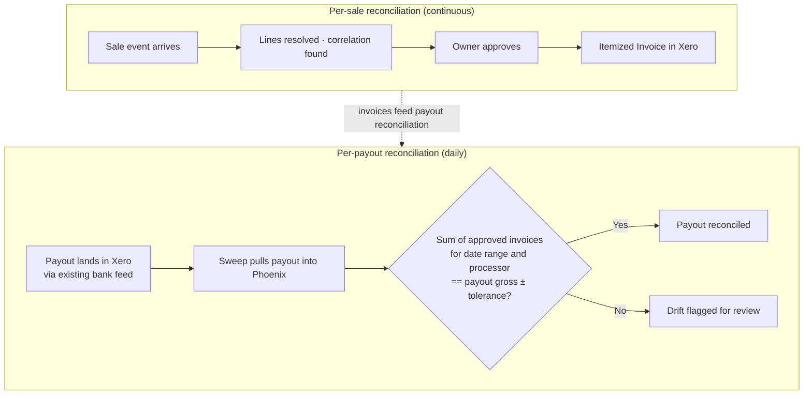
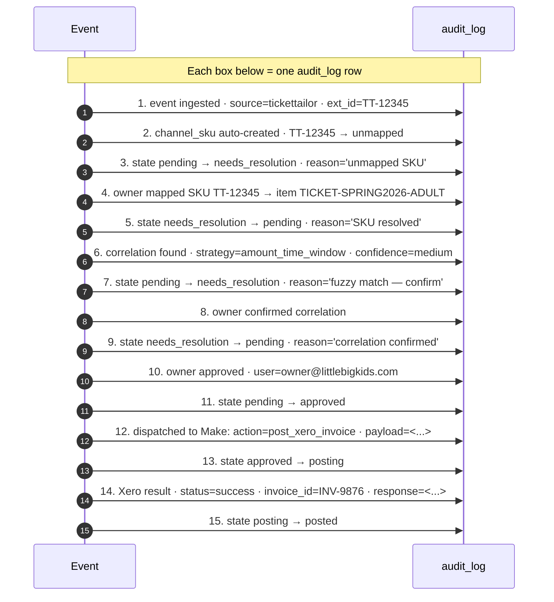
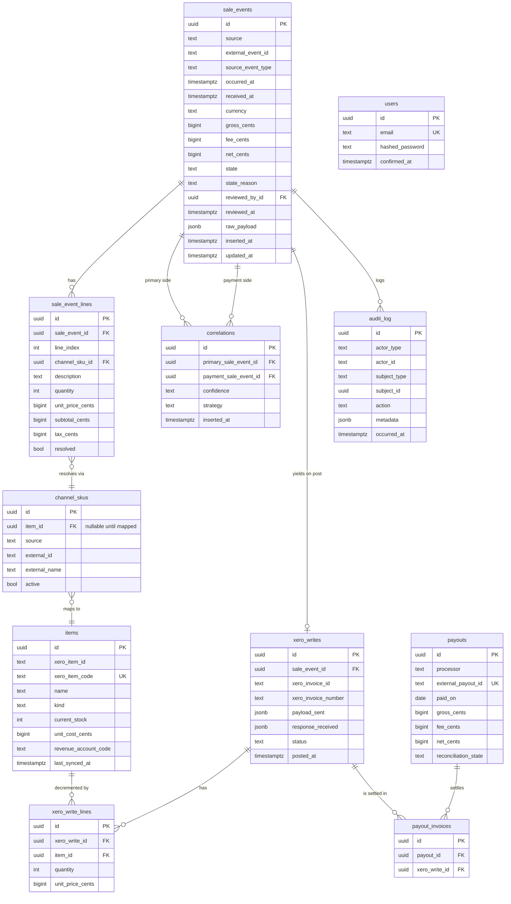

> **Document Version: 0.1** | 2026-05-21
>
> Draft for owner review. This document proposes **how** the system described in `docs/domain-model.md` will be built. The vocabulary used here assumes the domain model has been read first.

## 1. Executive overview

### The problem

LBK sells across four channels (Squarespace, Stripe, Square, TicketTailor) and accounts in Xero. Xero today receives net daily bank deposits from Stripe and Square, with no itemized detail. Result: LBK cannot answer item-level revenue questions, cannot reconcile what was actually sold against what was deposited, and cannot reliably track inventory across channels.

### The proposed solution

A small system with two halves:

- **Make.com** as the integration backbone — its strength is having pre-built connectors for every system in scope (Squarespace, Stripe, Square, TicketTailor, Xero). It handles all external API access.
- **A custom Phoenix LiveView dashboard** (this repo) as the reconciliation cockpit — where the owner reviews each sale, approves it, and posts an itemized invoice to Xero.

Every sale, from every channel, lands in the dashboard. The owner reviews and approves. The system posts a properly itemized invoice to Xero, which automatically decrements tracked inventory and posts revenue with per-item granularity. Existing Xero bank feeds continue to bring in payouts; the dashboard helps confirm those payouts reconcile against the approved invoices.

### Why this split

Make's strength is integration breadth (every connector pre-built); its weakness is holding state and orchestrating workflows. Phoenix LiveView's strength is reactive UIs and state management; its weakness would be reimplementing connectors LBK doesn't need to own. Combining them plays to each's strengths.

### What ships in v1, and what doesn't

**Ships:** end-to-end flow from channel sale → owner review → itemized Xero invoice → tracked inventory decrement. All four channels supported. Approval workflow with audit trail. SKU mapping admin. Read-only inventory view.

**Defers:** automated refunds, multi-user roles, mobile UI, multi-org Xero, analytics dashboards (Xero already has those), bidirectional sync from Xero back to channels.

## 2. High-level architecture



**Key boundaries:**

- **The dashboard never reaches outside its own DB and Make.** No direct calls to Squarespace, Stripe, Square, TicketTailor, or Xero from Phoenix.
- **Make holds no business state.** Scenarios are stateless transformers + HTTP relays. Re-running a scenario produces no harmful side effects.
- **The owner only interacts with the LiveView UI.** They do not touch Make's web UI for day-to-day operations; that's where the system was built, not where it is run.

## 3. Component view

### Make scenarios (5 types)

| # | Scenario | Trigger | Job |
|---|---|---|---|
| 1 | **Source-ingress** (one per channel: Squarespace, Stripe, Square, TicketTailor) | Webhook (preferred) or schedule | Receive raw event, normalize to canonical shape, POST to Phoenix `/api/v1/sale-events`. |
| 2 | **Cross-channel matcher** | Schedule (~15 min) | Pull unmatched sale events from Phoenix; for each, look up the paired payment event in the source (e.g. fetch the Stripe charge matching a TT order's metadata); POST correlations back. |
| 3 | **Xero-write** | HTTP webhook (Phoenix calls it on approval) | Build a Xero invoice payload from the approved Sale Event, post to Xero, send result (invoice id or failure) back to Phoenix. |
| 4 | **Inventory-snapshot** | Schedule (~hourly) | Pull all tracked items from Xero, POST a full snapshot to Phoenix. |
| 5 | **Reconciliation sweep** | Schedule (daily) | Pull Stripe/Square payouts from Xero's bank feed view; pull recent events from each source as a safety net for missed webhooks; POST any gaps to Phoenix. |

### Phoenix contexts

| Context | Responsibility | Key modules |
|---|---|---|
| **`Ingest`** | Accept normalized events from Make, dedupe, persist, route to lifecycle. | `Ingest.upsert_event/1`, `Ingest.resolve_lines/1` |
| **`Reconciliation`** | Match payment-to-sale events, apply state transitions, run the matching ladder. | `Reconciliation.try_correlate/1`, `Reconciliation.approve/2`, `Reconciliation.reject/2` |
| **`Inventory`** | Mirror Xero tracked items, expose stock snapshots. | `Inventory.snapshot_from_xero/1`, `Inventory.item_by_xero_code/1` |
| **`Audit`** | Append-only logging, forensic queries. | `Audit.record/3`, `Audit.timeline_for/1` |
| **`Channels`** | Channel SKU mapping admin: register unmapped SKUs, link to items, retire. | `Channels.upsert_sku/1`, `Channels.map_to_item/2` |
| **`XeroWrites`** | Outbound action dispatcher to Make's webhook + result handler. | `XeroWrites.dispatch/1`, `XeroWrites.handle_result/1` |
| **`Dashboard`** | LiveView modules. | `DashboardLive.Inbox`, `DashboardLive.EventDetail`, `DashboardLive.Skus`, `DashboardLive.Inventory` |

## 4. Key interaction flows

### Flow 1 — Sale ingestion from a single-channel sale (Squarespace)

```mermaid
sequenceDiagram
    autonumber
    actor Customer
    participant Squarespace
    participant Stripe
    participant Make as Make scenario<br/>(Squarespace ingress)
    participant Phoenix as Phoenix /api/v1
    participant DB as Postgres
    participant UI as LiveView (owner)

    Customer->>Squarespace: place order, pay
    Squarespace->>Stripe: create charge
    Stripe-->>Squarespace: charge succeeded
    Squarespace->>Make: order.created webhook
    Make->>Make: normalize to canonical shape<br/>(extract line items + SKUs)
    Make->>Phoenix: POST /sale-events (channel=squarespace)
    Phoenix->>DB: upsert sale_event (idempotent on external id)
    Phoenix->>DB: resolve lines via channel_skus
    Phoenix-->>Make: 201 + sale_event id

    Note over Stripe,Make: Separately, Stripe charge.succeeded<br/>webhook fires the Stripe ingress scenario
    Stripe->>Make: charge.succeeded webhook
    Make->>Phoenix: POST /sale-events (channel=stripe, metadata=squarespace_order_id)
    Phoenix->>DB: upsert; trigger correlation attempt
    Phoenix->>Phoenix: id_match strategy succeeds<br/>(charge.metadata.order_id == squarespace event id)
    Phoenix->>DB: insert correlation (high confidence)

    Phoenix->>UI: PubSub broadcast: new event ready
    UI-->>UI: inbox row appears in real time
```

### Flow 2 — Cross-channel correlation (TicketTailor + Stripe, fuzzy match)

```mermaid
sequenceDiagram
    autonumber
    actor Attendee
    participant TT as TicketTailor
    participant Stripe
    participant Make as Make scenarios
    participant Phoenix
    participant Matcher as Make matcher<br/>(scheduled)
    participant UI as LiveView

    Attendee->>TT: buy 2× Adult Pass
    TT->>Stripe: create charge $70
    Stripe-->>TT: charge succeeded
    TT-)Make: order.completed (TT ingress)
    Stripe-)Make: charge.succeeded (Stripe ingress)

    Make->>Phoenix: POST /sale-events × 2<br/>(TT event + Stripe event)
    Phoenix->>Phoenix: TT event: resolve lines<br/>(may require enrichment — see §5)
    Phoenix->>Phoenix: try_correlate(TT event):<br/>id_match fails (no Stripe id on TT side)<br/>metadata_match fails (no order_id on Stripe charge)<br/>amount_time_window: $70 ± 0¢, 60s window → match!
    Phoenix->>Phoenix: confidence: medium → route to needs_resolution<br/>reason: "fuzzy match — please confirm"

    Note over Matcher,Phoenix: 15 min later, scheduled matcher also runs
    Matcher->>Phoenix: GET /sale-events?state=needs_resolution&reason=fuzzy_match
    Matcher->>Stripe: lookup charge by id (re-check metadata)
    Stripe-->>Matcher: charge details (still no order_id)
    Matcher->>Phoenix: no new info; correlation unchanged

    UI-->>UI: owner sees event in needs_resolution<br/>with the proposed Stripe match
    actor Owner
    Owner->>UI: review, click "confirm match"
    UI->>Phoenix: confirm correlation
    Phoenix->>Phoenix: state → pending (ready to approve)
```

### Flow 3 — Owner approval → Xero post



### Flow 4 — Daily reconciliation sweep



## 5. Decision points

The non-trivial business decisions the system makes, made explicit.

### 5.1 SKU resolution at ingestion



### 5.2 Correlation strategy ladder



### 5.3 Approval readiness gate

```mermaid
flowchart TD
    A[Sale event in pending] --> B{All lines resolved?}
    B -->|No| NR1[needs_resolution: unmapped SKU]
    B -->|Yes| C{Correlation present<br/>(or Square self-correlated)?}
    C -->|No| NR2[needs_resolution: no payment side]
    C -->|Yes, confidence=high| D{Sum of lines = gross ±$0.50?}
    C -->|Yes, confidence=medium| NR3[needs_resolution: confirm fuzzy match]
    D -->|Yes| READY[ready to approve · show in 'ready' tab]
    D -->|No| NR4[needs_resolution: amount mismatch]
```

### 5.4 Approval failure recovery

```mermaid
flowchart TD
    A[Owner clicks Approve] --> B[state: approved]
    B --> C[Dispatch to Make Xero-write webhook]
    C --> D{Make scenario succeeds end-to-end?}
    D -->|Yes — invoice posted| E[state: posted · audit entry · UI updates]
    D -->|No — Xero rejected (4xx)| F[state: failed · capture Xero error]
    D -->|No — Make scenario error / 5xx| G{Within Make retry budget?}
    G -->|Yes| H[Make retries with backoff]
    G -->|No, exhausted| I[state: failed · reason: 'integration error']
    F --> J[owner sees error · fixes underlying issue<br/>(remap SKU, update item, etc.)]
    J --> K[owner clicks Retry · state: pending]
    K --> A
    I --> J
    H --> D
```

## 6. Reconciliation model — two sides

Reconciliation in this system happens at **two distinct granularities**, and conflating them is the trap to avoid.



**Per-sale reconciliation** is what the owner does most days: confirm an event is correctly captured, approve, an itemized invoice posts. This is event-level — one approval = one invoice.

**Per-payout reconciliation** is the closure step: every few days, when Stripe or Square deposits a lump sum into the bank account, the bank feed brings it into Xero. We then check that the sum of approved invoices for the right window matches that deposit. Drift means either a missing invoice (we never ingested the event), a duplicated invoice, or a fee/timing edge case worth investigating.

**Why both matter:** per-sale gets you item-level revenue granularity. Per-payout closes the loop end-to-end against the bank account.

## 7. Audit trail

Every meaningful action emits an audit entry. The audit log is append-only and forensically complete: it answers "show me the full history of TicketTailor order TT-12345" in one query.

### What gets logged

| Action | What's captured |
|---|---|
| Sale event ingested | source, external id, normalized payload, ingestion time |
| State transition (any) | from_state, to_state, actor (system / user id), reason |
| Channel SKU created (unmapped) | external id, source, triggering sale event |
| Channel SKU mapped | sku id, mapped-to item id, actor |
| Correlation created | primary id, payment id, strategy, confidence |
| Owner approval | sale event id, user id, dashboard URL at time of approval |
| Make webhook dispatched | sale event id, action, payload sent |
| Xero write result received | request payload, response payload, status, latency |
| Voiding an invoice | xero invoice id, reason, user id |

### Example: end-to-end trace of one sale



A single query against `audit_log WHERE subject_id = 'TT-12345'` reproduces the full trace above.

### Immutability guarantees

- Audit log rows are written, never updated or deleted. Enforced by database role permissions in production, not just by application convention.
- Every state transition writes its audit row in the same database transaction as the state change itself. There is no window where a state has changed without a corresponding audit entry, or vice versa.
- The `xero_writes` table captures the full request and response payloads to/from Xero, in JSON. Useful for both forensic review and reproducing a failure offline.

## 8. Data model

The full entity-relationship diagram appears in `docs/domain-model.md` §4.1. Here we focus on the **implementation specifics** — concrete table names, column types, indexes.



**Key indexes:**

- `sale_events`: `unique(source, external_event_id)` for idempotency; index on `(state, occurred_at)` for inbox queries; index on `(state_reason)` for filter chips.
- `channel_skus`: `unique(source, external_id)`; partial index on rows where `item_id IS NULL` (the "unmapped" queue).
- `correlations`: `unique(primary_sale_event_id)` and `unique(payment_sale_event_id)` to enforce "at most one correlation per side".
- `xero_writes`: `unique(sale_event_id)` to enforce "at most one invoice per sale event"; `unique(xero_invoice_id)`.
- `audit_log`: index on `(subject_type, subject_id, occurred_at)` for forensic queries.

## 9. API contract (Make ↔ Phoenix)

All endpoints under `/api/v1`. JSON request/response. Bearer token auth (`Authorization: Bearer <env-var>`).

### Inbound (Make → Phoenix)

| Method | Path | Purpose | Idempotency |
|---|---|---|---|
| `POST` | `/sale-events` | Ingest a normalized event. | `unique(source, external_event_id)` + `Idempotency-Key` header (24h dedupe). |
| `POST` | `/correlations` | Push a discovered pairing. | `unique(primary_id, payment_id)`. |
| `POST` | `/inventory-snapshot` | Bulk-replace cached item stock. | Whole-snapshot replace; per-call ok to retry. |
| `POST` | `/payouts` | Push payout records from Xero bank feed. | `unique(processor, external_payout_id)`. |
| `POST` | `/xero-write-result` | Callback from Xero-write scenario with success/failure. | `unique(sale_event_id)` — once posted, second result is logged but ignored for state. |

Sample inbound payload (`POST /sale-events`):

```json
{
  "source": "squarespace",
  "external_event_id": "sqs_order_9876",
  "source_event_type": "order.created",
  "occurred_at": "2026-05-21T14:23:11Z",
  "currency": "USD",
  "gross_cents": 8500,
  "fee_cents": 280,
  "net_cents": 8220,
  "lines": [
    {
      "line_index": 0,
      "external_sku": "var_tshirt_red_L",
      "description": "LBK T-shirt — red, large",
      "quantity": 2,
      "unit_price_cents": 2500,
      "subtotal_cents": 5000,
      "tax_cents": 0
    },
    {
      "line_index": 1,
      "external_sku": "var_book_adventure",
      "description": "Picture book: The Big Adventure",
      "quantity": 1,
      "unit_price_cents": 3500,
      "subtotal_cents": 3500,
      "tax_cents": 0
    }
  ],
  "raw_payload": { "...": "verbatim source webhook for forensics" }
}
```

### Outbound (Phoenix → Make)

Phoenix calls a single Make webhook URL. Make routes by `action`:

| `action` | Trigger | Payload |
|---|---|---|
| `post_xero_invoice` | Owner approves an event | sale_event_id + full invoice payload |
| `refresh_inventory` | Manual refresh button in dashboard | (no payload) |
| `reprocess_event` | Owner clicks "retry" on a failed event | sale_event_id |
| `void_invoice` | Owner voids a posted invoice | xero_invoice_id + reason |

## 10. Operational concerns

### Idempotency (four layers, see §5.4 for context)

1. `sale_events` unique on `(source, external_event_id)` — webhook re-deliveries no-op.
2. `Idempotency-Key` header on every API call — short-lived dedupe cache.
3. LiveView approve actions are state-guarded — re-clicking is a no-op.
4. Xero `Invoice.Reference = "lbkmk:<sale_event.id>"` — Make checks for existing before creating.

### Failure modes

See §5.4 and Flow 4. The TL;DR: webhooks for happy path, scheduled sweep as safety net, no single point of data loss because each source keeps its own record of every event.

### Deployment shape (high level — specifics chosen at deploy time)

- **Phoenix app** runs in any container host (Fly.io, Railway, Render, self-hosted). Two requirements: a publicly reachable URL (so Make can webhook in) and a Postgres database.
- **Postgres** managed by the host or external (Supabase, Neon). Daily backups; retention TBD by the owner.
- **Secrets** (bearer token, DB URL, Make webhook URL) injected via the host's secrets management. Bearer token rotates on a quarterly cadence; runbook in Phase 4.
- **Make.com** runs as SaaS. Subscription tier sized to total monthly ops; sized after Phase 0 volume estimates.

### Observability

- Phoenix LiveDashboard for runtime metrics (request rates, query times).
- Structured logs on every Make→Phoenix call: source, event_id, outcome, latency.
- Error tracking (Sentry / AppSignal / Honeybadger) added at deploy time.

## 11. What's explicitly **not** in scope (v1)

| Not in scope | Reason | When to revisit |
|---|---|---|
| Refund / return flow | Volume low; manual in Xero is acceptable. | Once monthly refund volume > ~10. |
| Multi-currency | USD only. | If LBK ever sells internationally. |
| Multi-org / multi-tenant | Single LBK org. | Not foreseen. |
| Multi-user roles | One operator. | When hiring second ops staff. |
| Mobile UI | Desktop bookkeeper workflow. | If usage patterns shift. |
| Analytics / BI dashboards | Xero already has reporting. | Not foreseen. |
| Sync **from** Xero back to channels | Product catalog stays managed in channels. | If channels need centralized catalog management. |
| Direct Phoenix → external APIs | Make owns all external API access. | Deliberate later decision, not drift. |

## 12. Open questions (must close before implementation starts)

| # | Question | Affects | Owner |
|---|---|---|---|
| Q1 | Does TicketTailor expose line items in webhooks/API, or do we need enrichment? | Line-item ingestion code path; potential extra Make API ops cost | Phase 0 spike |
| Q2 | Are Xero bank feeds active for Stripe and Square already? | Whether our invoices reconcile against existing deposits or risk duplicates | Owner / accountant |
| Q3 | Are existing Xero items tracked or untracked? | Onboarding scope: conversion + seeding | Owner / accountant |
| Q4 | Per-event ticket types: separate Inventory Items per event, or reused? | Domain model: §4.2 Inventory Item assumes per-event | Owner |
| Q5 | What's the expected monthly transaction volume across all channels? | Make.com plan sizing; Phoenix capacity | Owner |
| Q6 | Vocabulary alignment (see domain model §7) | UI labels and documentation tone | Owner review |
| Q7 | Hosting target preference (Fly.io / Railway / Render / self-host) | Deploy script and secrets management | Owner / ops |

## 13. Proposed delivery phases (high level)

Detailed phasing belongs in the implementation plan (next document). At a glance:

1. **Phase 0 — Discovery** (close all questions in §12).
2. **Phase 1 — End-to-end proof with Squarespace + Stripe + Xero.**
3. **Phase 2 — Add Square and TicketTailor; correlation across channels.**
4. **Phase 3 — Reconciliation sweep + payouts view.**
5. **Phase 4 — Hardening, audit UI, invoice void.**

Each phase produces a usable system; later phases add coverage and depth.
