> **Document Version: 0.2** | 2026-05-22
>
> Draft for owner review. This document proposes **how** the system described in `docs/domain-model.md` will be built. The vocabulary used here assumes the domain model has been read first.
>
> **Changed in v0.2:** mechanism-level corrections from `docs/2026-05-22-solution-proposal-delta.md`, driven by the six per-tool integration references under `docs/integrations/`. The overall architecture is unchanged. Specific changes are called out inline as `[v0.2]`.

## 1. Executive overview

### The problem

LBK sells across four channels (Squarespace, Stripe, Square, TicketTailor) and accounts in Xero. Xero today receives net daily bank deposits from Stripe and Square, with no itemized detail. Result: LBK cannot answer item-level revenue questions, cannot reconcile what was actually sold against what was deposited, and cannot reliably track inventory across channels.

### The proposed solution

A small system with two halves:

- **Make.com** as the integration backbone — its strength is having pre-built connectors for every system in scope (Squarespace, Stripe, Square, TicketTailor, Xero). It handles all external API access.
- **A custom Phoenix LiveView dashboard** (this repo) as the reconciliation cockpit — where the owner reviews each sale, approves it, and posts an itemized invoice to Xero.

Every sale, from every channel, lands in the dashboard. The owner reviews and approves. The system posts a properly itemized invoice to Xero, which automatically decrements tracked inventory and posts revenue with per-item granularity. Existing Xero bank feeds continue to bring in payouts; the dashboard helps confirm those payouts reconcile against the approved invoices.

### Why this split

Make's strength is integration breadth (every connector pre-built); its weakness is holding state and orchestrating workflows. Phoenix LiveView's strength is reactive UIs and state management; its weakness would be reimplementing connectors LBK doesn't need to own. Combining them plays to each's strengths.

### What ships in v1, and what doesn't

**Ships:** end-to-end flow from channel sale → owner review → itemized Xero invoice → tracked inventory decrement. All four channels supported. Approval workflow with audit trail. SKU mapping admin. Read-only inventory view.

**Defers:** automated refunds, multi-user roles, mobile UI, multi-org Xero, analytics dashboards (Xero already has those), bidirectional sync from Xero back to channels.

## 2. High-level architecture

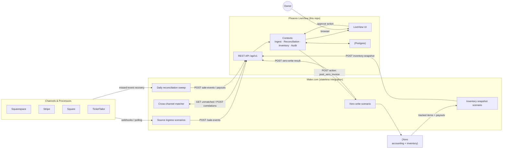

**Key boundaries:**

- **The dashboard never reaches outside its own DB and Make.** No direct calls to Squarespace, Stripe, Square, TicketTailor, or Xero from Phoenix.
- **Make holds no business state.** Scenarios are stateless transformers + HTTP relays. Re-running a scenario produces no harmful side effects.
- **The owner only interacts with the LiveView UI.** They do not touch Make's web UI for day-to-day operations; that's where the system was built, not where it is run.

## 3. Component view

### Make scenarios (5 types)

| # | Scenario | Trigger | Job |
|---|---|---|---|
| 1 | **Source-ingress** (one per channel: Squarespace, Stripe, Square, TicketTailor) | Webhook (preferred) or schedule | Receive raw event, **[v0.2] enrich where the webhook is notification-grade** (Squarespace: `GET /1.0/commerce/orders/{id}` + `GET /1.0/commerce/transactions/{id}`; Stripe: expand `balance_transaction` for fee detail), normalize to canonical shape, POST to Phoenix `/api/v1/sale-events`. Every channel ingress scenario must attach a **Break error handler** to its HTTP module with a configured attempt count — Make does not retry HTTP modules natively. See `docs/integrations/make.md` and the per-channel docs under `docs/integrations/`. |
| 2 | **Cross-channel matcher** | Schedule (~15 min) | Pull unmatched sale events from Phoenix; for each, look up the paired payment event in the source. **[v0.2] Note:** the deterministic forward direction is Squarespace's Transactions API publishing the Stripe `ch_...`; the reverse direction (Stripe carrying the upstream order id) is not guaranteed. TicketTailor ↔ Stripe deterministic correlation is unverified pending issue #3/#29 — heuristic fallback until then. |
| 3 | **Xero-write** | HTTP webhook (Phoenix calls it on approval) | Build a Xero invoice payload from the approved Sale Event, post to Xero **as `ACCREC AUTHORISED`** (DRAFT invoices do not decrement tracked inventory), send result back to Phoenix. Mandatory Break handler with at least 3 attempts on the Xero HTTP module. |
| 4 | **Inventory-snapshot** | Schedule (~hourly) | Pull all tracked items from Xero, POST a full snapshot to Phoenix. |
| 5 | **Reconciliation sweep** | Schedule (daily) | Pull Stripe/Square payouts from Xero's bank feed view; pull recent events from each source as a safety net for missed webhooks; POST any gaps to Phoenix. |

### Phoenix contexts

| Context | Responsibility | Key modules |
|---|---|---|
| **`Ingest`** | Accept normalized events from Make, dedupe, persist, route to lifecycle. | `Ingest.upsert_event/1`, `Ingest.resolve_lines/1` |
| **`Reconciliation`** | Match payment-to-sale events (catalog kind 1, §6), check line totals (kind 2), apply state transitions, run the matching ladder. Hosts the daily payout sweep job (kind 4). | `Reconciliation.try_correlate/1`, `Reconciliation.approve/2`, `Reconciliation.reject/2`, `Reconciliation.sweep_payouts/0` |
| **`Inventory`** | Mirror Xero tracked items, expose stock snapshots. | `Inventory.snapshot_from_xero/1`, `Inventory.item_by_xero_code/1` |
| **`Audit`** | Append-only logging, forensic queries. | `Audit.record/3`, `Audit.timeline_for/1` |
| **`Channels`** | Channel SKU mapping admin: register unmapped SKUs, link to items, retire. | `Channels.upsert_sku/1`, `Channels.map_to_item/2` |
| **`XeroWrites`** | Outbound action dispatcher to Make's webhook + result handler. | `XeroWrites.dispatch/1`, `XeroWrites.handle_result/1` |
| **`Dashboard`** | LiveView modules. | `DashboardLive.Inbox`, `DashboardLive.EventDetail`, `DashboardLive.Skus`, `DashboardLive.Inventory` |

## 4. Key interaction flows

### Flow 1 — Sale ingestion from a single-channel sale (Squarespace)

**[v0.2] Corrected:** Squarespace's `order.create` webhook ships only `{ orderId }` — Make must enrich via two GETs. The deterministic Stripe correlation runs from Squarespace's Transactions API (which publishes the Stripe `ch_...`), not from Stripe's `Charge.metadata` (which channels are not guaranteed to populate). See `docs/integrations/squarespace.md` and `docs/integrations/stripe.md`.

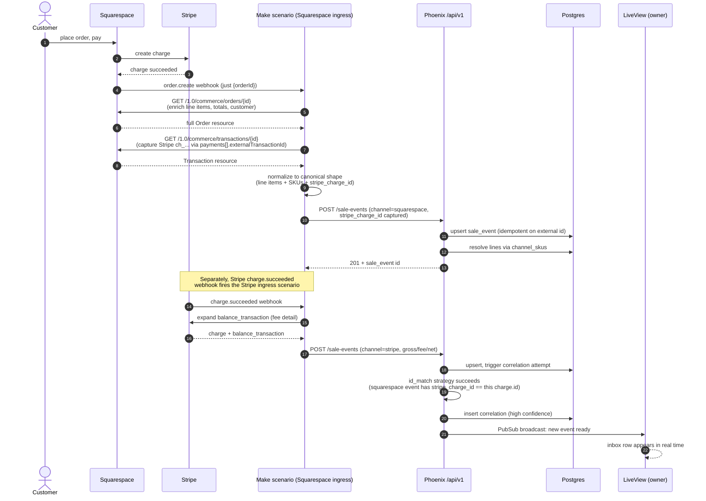

### Flow 2 — Cross-channel correlation (TicketTailor + Stripe, fuzzy match)

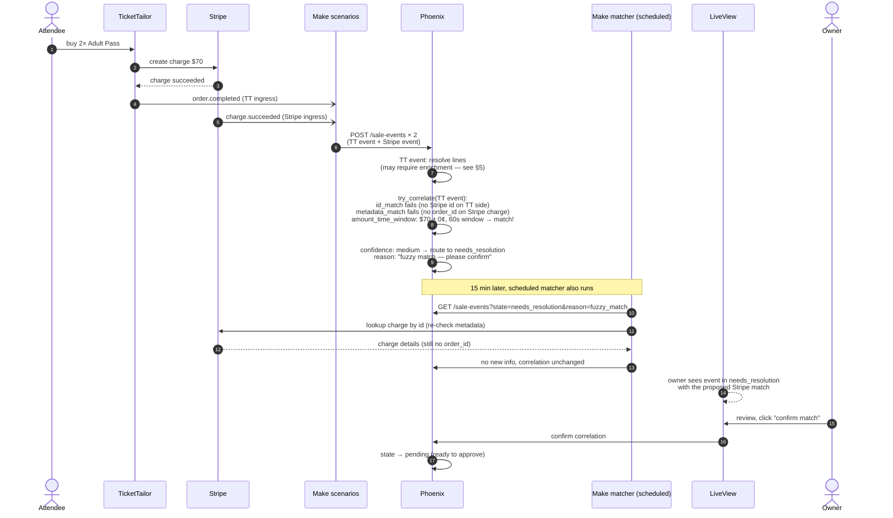

### Flow 3 — Owner approval → Xero post

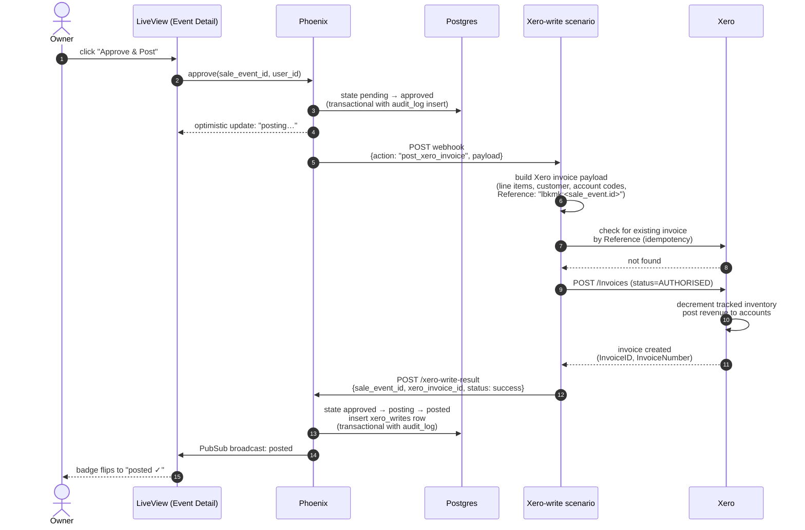

### Flow 4 — Daily reconciliation sweep (catalog kind 4 — see §6)

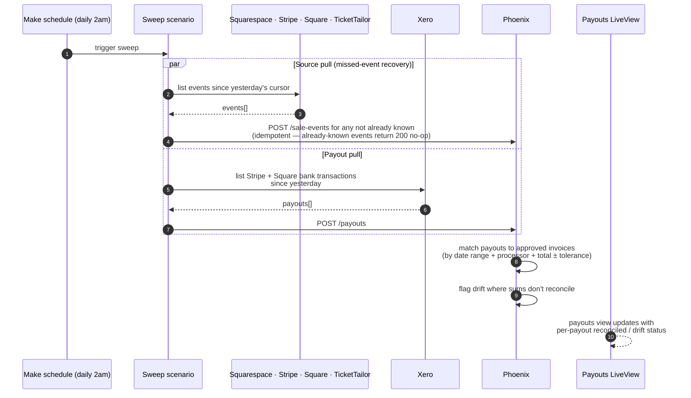

## 5. Decision points

The non-trivial business decisions the system makes, made explicit.

### 5.1 SKU resolution at ingestion

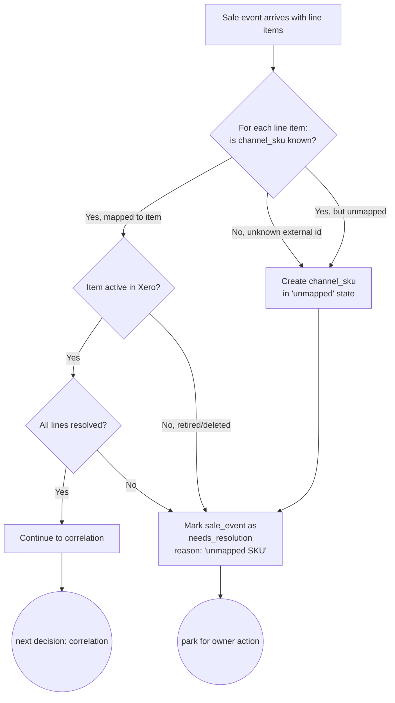

### 5.2 Correlation strategy ladder

**[v0.2] Per-channel reality check:** the ladder works as drawn for Squarespace ↔ Stripe (deterministic via the Squarespace Transactions API). For **TicketTailor ↔ Stripe**, the deterministic path is unverified — TicketTailor's `payment_method.external_id` *probably* carries the Stripe `ch_...` or `pi_...` but this is filed for empirical confirmation (issues #3, #29). Until then, TicketTailor sales fall through to `amount_time_window` with `confidence: medium` and route to `needs_resolution` — the owner will see a "confirm fuzzy match" prompt on most TicketTailor sales until that one issue closes. Square and direct-Stripe sales correlate self-contained (sale-side and payment-side come from the same vendor).

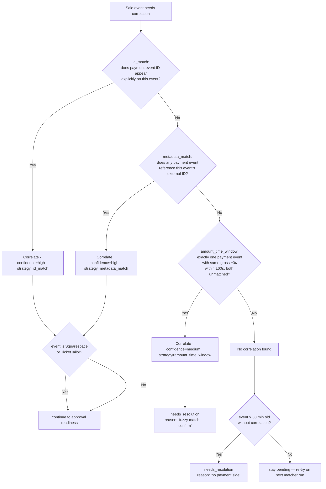

### 5.3 Approval readiness gate

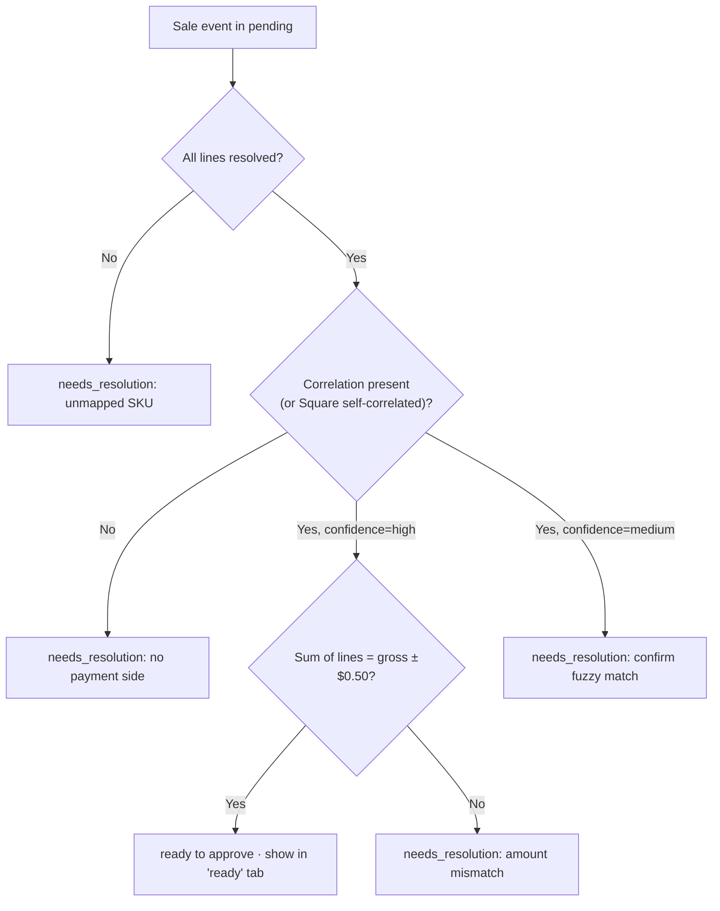

### 5.4 Approval failure recovery

**[v0.2] Corrected:** Make's HTTP module does **not** retry automatically. The retry behaviour shown below is provided by an explicit **Break error handler** attached to the HTTP module, with a configured attempt count and backoff. Without that handler, a single 5xx from Xero terminates the scenario run and the event is recoverable only via the daily sweep. See `docs/integrations/make.md` §Error handling.

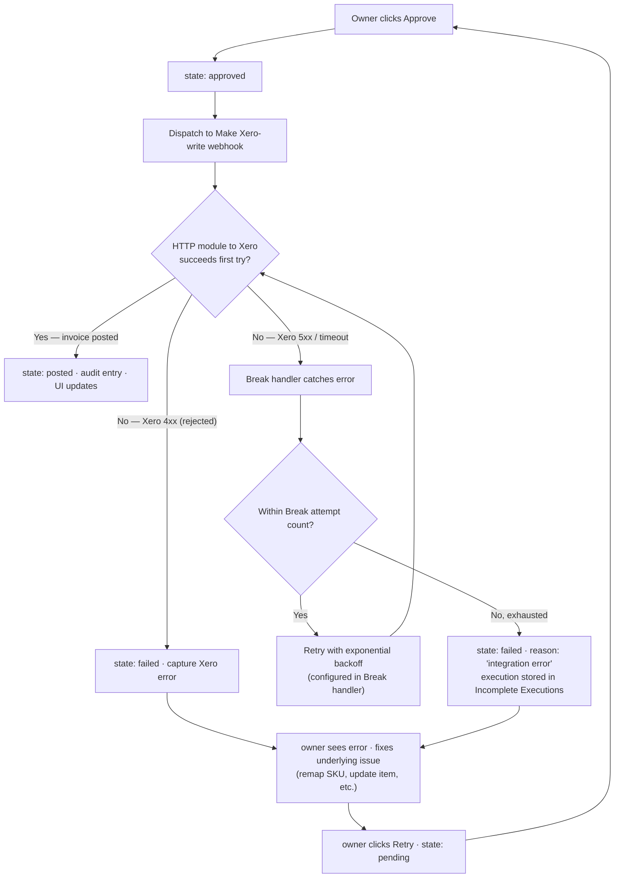

## 6. Reconciliation Catalog

Reconciliation is the load-bearing feature of this system, and the docs that came before this section have used the word loosely. To be precise: **LBK's "transaction reconciliation" is a family of four distinct comparisons**, each with its own pair of sides, its own source systems, its own trigger, and its own definition of success. This section lists them. §7 ("Reconciliation cadence") describes *when* each one runs.

### The four kinds

| # | Kind | Left side | Right side | Source of left | Source of right | Trigger | Actor | Success criterion |
|---|---|---|---|---|---|---|---|---|
| 1 | **Sale ↔ Payment correlation** | A sale-side event | The payment-side event that paid for it | Squarespace, TicketTailor | Stripe (Square is unified — self-correlates) | On ingest of either side | System | Both sides linked; one Sale Event covers both rows |
| 2 | **Line totals ↔ event gross** (internal sanity check) | Sum of resolved Line Item amounts | The event's gross amount | Channel payload (lines) | Same channel payload (header) | On ingest | System | Difference within $0.50 tolerance |
| 3 | **Sale Event ↔ Xero Invoice** | Approved Sale Event in Phoenix | Posted Invoice in Xero | Phoenix DB | Xero API (idempotent on `Reference`) | Owner clicks Approve | Owner (initiates), System (writes) | Xero confirms `posted`; Invoice id stored on Sale Event |
| 4 | **Approved invoices ↔ Payout** | Sum of net amounts of approved Invoices for a (processor, date-window) | Payout amount landed in Xero via bank feed | Phoenix + Xero | Stripe / Square payout via Xero bank feed | Daily sweep | System flags, Owner reviews drift | Sums match within tolerance; else `drift_flagged` |

### Where each kind physically happens

- **Kind 1 (sale ↔ payment correlation)** runs in the Phoenix `Reconciliation` context, triggered by webhook ingest from Make. The matching ladder in §5.2 — `id_match`, then `metadata_match`, then `amount_time_window` — is the algorithm for this kind. Square does not need this step because its sale and payment arrive in one payload.
- **Kind 2 (line totals ↔ event gross)** also runs in the `Reconciliation` context, on ingest. Rule 3 in `domain-model.md` §6 sets the $0.50 tolerance. A failure routes the Sale Event to `needs_resolution` with reason `amount mismatch`.
- **Kind 3 (Sale Event ↔ Xero Invoice)** is the outbound side. The Phoenix `XeroWrites` context dispatches to the Make Xero-write scenario on owner approval; the result handler closes the loop. Idempotency on the `Reference` field carrying the Sale Event id prevents duplicate Invoices on retry.
- **Kind 4 (approved invoices ↔ Payout)** runs in a scheduled job inside the `Reconciliation` context (`Reconciliation.sweep_payouts/0`), triggered by the daily Make sweep — see Flow 4 in §4. Compares the local sum of approved Invoice nets against the payout amount that the bank feed brought into Xero.

### How the catalog overlays the architecture

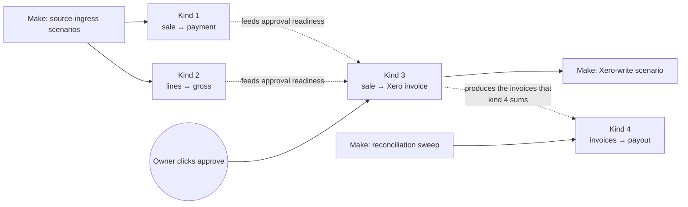

Reading the diagram: kinds 1 and 2 must succeed at ingest before a Sale Event can be approved. Kind 3 runs at the moment of approval. Kind 4 closes the loop end-to-end, days later, against the bank deposit.

### What "drift" looks like, per kind

| Kind | Drift / failure surface | Resolution |
|---|---|---|
| 1 | No matching payment side after 30 min → `needs_resolution`, reason `no payment side` | Owner investigates; usually a missing webhook or a refund |
| 2 | Line sums don't equal gross beyond $0.50 → `needs_resolution`, reason `amount mismatch` | Owner inspects line items; usually a fee anomaly or split charge |
| 3 | Xero rejects the invoice post → Sale Event state `failed` | Owner fixes underlying issue (remap SKU, update item), clicks Retry |
| 4 | Payout total ≠ sum of approved invoices → Payout state `drift_flagged` | Owner reviews; usually a missing ingest, a duplicate, or a fee/timing edge case |

## 7. Reconciliation cadence — continuous vs daily

Where §6 enumerates *what* gets reconciled, this section describes *when*. The four catalog kinds run on two cadences:

- **Continuous** — every event, in real time: kinds 1 and 2 (at ingest) and kind 3 (at approval).
- **Daily** — once per day, at the end-of-period sweep: kind 4 (payout closure).

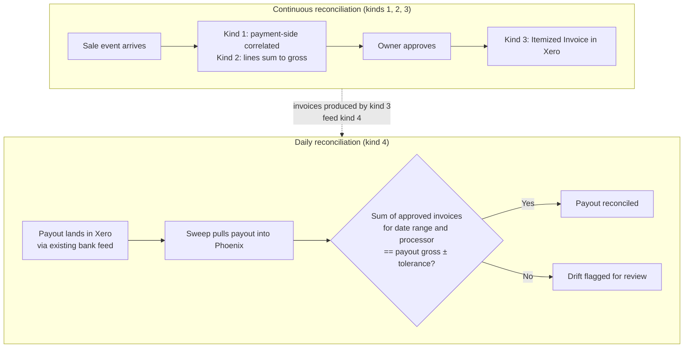

**Continuous reconciliation (kinds 1–3)** is what the owner sees most days: events arrive, kinds 1 and 2 fire automatically on ingest, the owner approves clean events, kind 3 posts the itemized invoice to Xero. One approval = one invoice.

**Daily reconciliation (kind 4)** is the closure step. Every few days, Stripe or Square deposits a lump sum into the bank account, the existing Xero bank feed brings it in as a bank transaction, and the daily sweep (Flow 4 in §4) compares the deposit against the sum of approved invoices for the matching window. Drift means a missing invoice (we never ingested the event), a duplicated invoice, or a fee/timing edge case worth investigating.

**Why both cadences matter:** continuous reconciliation gives item-level revenue granularity (without it, Xero just sees lump-sum payouts). Daily reconciliation closes the loop end-to-end against the bank account (without it, the per-item picture could quietly diverge from the actual money).

## 8. Audit trail

Every meaningful action emits an audit entry. The audit log is append-only and forensically complete: it answers "show me the full history of TicketTailor order TT-12345" in one query.

### What gets logged

| Action | What's captured |
|---|---|
| Sale event ingested | source, external id, normalized payload, ingestion time |
| State transition (any) | from_state, to_state, actor (system / user id), reason |
| Channel SKU created (unmapped) | external id, source, triggering sale event |
| Channel SKU mapped | sku id, mapped-to item id, actor |
| Correlation created | primary id, payment id, strategy, confidence |
| Owner approval | sale event id, user id, dashboard URL at time of approval |
| Make webhook dispatched | sale event id, action, payload sent |
| Xero write result received | request payload, response payload, status, latency |
| Voiding an invoice | xero invoice id, reason, user id |

### Example: end-to-end trace of one sale

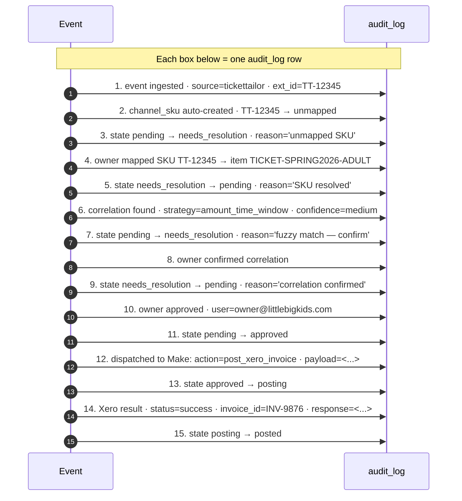

A single query against `audit_log WHERE subject_id = 'TT-12345'` reproduces the full trace above.

### Immutability guarantees

- Audit log rows are written, never updated or deleted. Enforced by database role permissions in production, not just by application convention.
- Every state transition writes its audit row in the same database transaction as the state change itself. There is no window where a state has changed without a corresponding audit entry, or vice versa.
- The `xero_writes` table captures the full request and response payloads to/from Xero, in JSON. Useful for both forensic review and reproducing a failure offline.

## 9. Data model

The full entity-relationship diagram appears in `docs/domain-model.md` §4.1. Here we focus on the **implementation specifics** — concrete table names, column types, indexes.

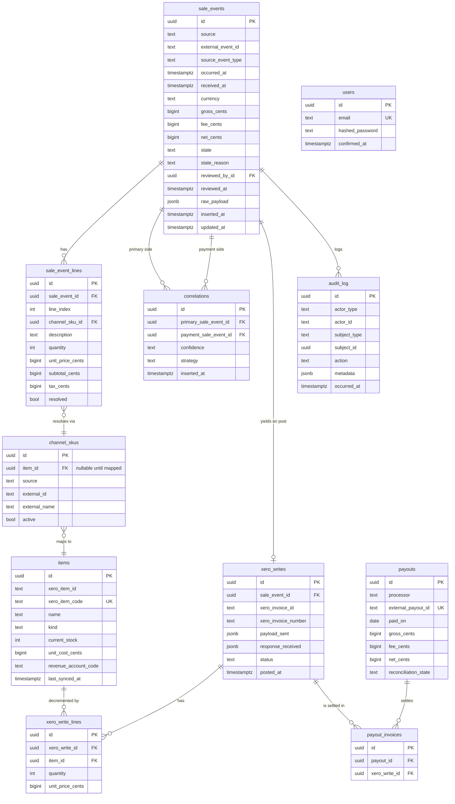

**Key indexes:**

- `sale_events`: `unique(source, external_event_id)` for idempotency; index on `(state, occurred_at)` for inbox queries; index on `(state_reason)` for filter chips.
- `channel_skus`: `unique(source, external_id)`; partial index on rows where `item_id IS NULL` (the "unmapped" queue).

**[v0.2] Data-protection requirements:**

- `sale_events.raw_payload` (and any other column containing source webhook bodies) must be **encrypted at rest**. Stripe events carry `card.last4` and `billing_details` (name, postcode); Squarespace and Square payloads carry similar fields. We never see PAN/CVC, but the combination is identifying PII. Encryption at the DB or column level (e.g. Cloak with a managed key) is the bar.
- Access control: `raw_payload` reads should be limited to the ingest + audit roles. Routine reporting queries must read normalized columns, never the raw body.
- `tenant_id` column: every entity that touches Xero (`sale_events`, `items`, `channel_skus`, `xero_writes`, `payouts`) should carry a non-null `tenant_id` from day one even though v1 ships single-tenant. Retrofitting tenant-awareness onto a single-tenant schema is famously painful; the cost of adding it now is one column per table. See `docs/integrations/xero.md` Open Questions #14.
- `correlations`: `unique(primary_sale_event_id)` and `unique(payment_sale_event_id)` to enforce "at most one correlation per side".
- `xero_writes`: `unique(sale_event_id)` to enforce "at most one invoice per sale event"; `unique(xero_invoice_id)`.
- `audit_log`: index on `(subject_type, subject_id, occurred_at)` for forensic queries.

## 10. API contract (Make ↔ Phoenix)

All endpoints under `/api/v1`. JSON request/response. Bearer token auth (`Authorization: Bearer <env-var>`).

### Inbound (Make → Phoenix)

| Method | Path | Purpose | Idempotency |
|---|---|---|---|
| `POST` | `/sale-events` | Ingest a normalized event. | `unique(source, external_event_id)` + `Idempotency-Key` header (24h dedupe). |
| `POST` | `/correlations` | Push a discovered pairing. | `unique(primary_id, payment_id)`. |
| `POST` | `/inventory-snapshot` | Bulk-replace cached item stock. | Whole-snapshot replace; per-call ok to retry. |
| `POST` | `/payouts` | Push payout records from Xero bank feed. | `unique(processor, external_payout_id)`. |
| `POST` | `/xero-write-result` | Callback from Xero-write scenario with success/failure. | `unique(sale_event_id)` — once posted, second result is logged but ignored for state. |

**[v0.2] Per-channel enrichment requirements before POSTing:**

| Channel | Required Make-side enrichment before POST |
|---|---|
| TicketTailor | None — `order.created` webhook ships line items. |
| Squarespace | `GET /1.0/commerce/orders/{id}` (line items) **and** `GET /1.0/commerce/transactions/{id}` (Stripe `ch_...`). |
| Square | Re-fetch via `GET /v2/orders/{id}` recommended — webhook line-item presence unconfirmed (issue #40). |
| Stripe | Expand `balance_transaction` on the charge (for `fee_cents`). Without this, `fee_cents` will be NULL. |

Sample inbound payload (`POST /sale-events`):

```json
{
  "source": "squarespace",
  "external_event_id": "sqs_order_9876",
  "source_event_type": "order.created",
  "occurred_at": "2026-05-21T14:23:11Z",
  "currency": "USD",
  "gross_cents": 8500,
  "fee_cents": 280,
  "net_cents": 8220,
  "lines": [
    {
      "line_index": 0,
      "external_sku": "var_tshirt_red_L",
      "description": "LBK T-shirt — red, large",
      "quantity": 2,
      "unit_price_cents": 2500,
      "subtotal_cents": 5000,
      "tax_cents": 0
    },
    {
      "line_index": 1,
      "external_sku": "var_book_adventure",
      "description": "Picture book: The Big Adventure",
      "quantity": 1,
      "unit_price_cents": 3500,
      "subtotal_cents": 3500,
      "tax_cents": 0
    }
  ],
  "raw_payload": { "...": "verbatim source webhook for forensics" }
}
```

### Outbound (Phoenix → Make)

Phoenix calls a single Make webhook URL. Make routes by `action`:

| `action` | Trigger | Payload |
|---|---|---|
| `post_xero_invoice` | Owner approves an event | sale_event_id + full invoice payload |
| `refresh_inventory` | Manual refresh button in dashboard | (no payload) |
| `reprocess_event` | Owner clicks "retry" on a failed event | sale_event_id |
| `void_invoice` | Owner voids a posted invoice | xero_invoice_id + reason |

## 11. Operational concerns

### Idempotency (five layers — **[v0.2] added Xero header**)

1. `sale_events` unique on `(source, external_event_id)` — webhook re-deliveries no-op.
2. `Idempotency-Key` header on every Make→Phoenix call — short-lived dedupe cache.
3. LiveView approve actions are state-guarded — re-clicking is a no-op.
4. Xero `Invoice.Reference = "lbkmk:<sale_event.id>"` — Make checks for existing before creating (durable, the source-of-truth dedupe layer).
5. **[v0.2]** Xero `Idempotency-Key` header on `POST /Invoices` (supported since 2023) — belt-and-braces alongside the Reference check. Retention window not publicly documented (issue #58); the Reference layer covers the long-tail.

### Per-channel signature verification

Signature schemes differ per channel. lbkmk verifies on the **raw body** before JSON parsing; Make forwards the raw body and the original signing header. See each channel's integration doc for the exact algorithm and canonicalization.

| Channel | Header | Algorithm | Notes |
|---|---|---|---|
| TicketTailor | `Tickettailor-Webhook-Signature: t=<unix>,v1=<hmac>` | HMAC-SHA256 over `timestamp + raw_body` | Reject if `t` older than 5 minutes (replay window). |
| Squarespace | `Squarespace-Signature: <hex hmac>` | HMAC-SHA256 over raw body, **with the secret hex-decoded to raw bytes** (passing the hex string silently produces a wrong signature). | — |
| Stripe | `Stripe-Signature: t=<unix>,v1=<hex hmac>` | HMAC-SHA256 over `timestamp + raw_body` | Enforce 5-minute timestamp tolerance. |
| Square | `x-square-hmacsha256-signature: <base64 hmac>` | HMAC-SHA256 over `notification_url + raw_body` (URL byte-for-byte vs registered string). Unique among the four — naive verifier for the others silently fails on Square. | URL canonicalization edge rewrites (trailing slash, www, HTTPS) break verification. |

### Ingress ACK window (Square is the constraint)

| Channel | Hard ACK window |
|---|---|
| TicketTailor | 30 s (then counted failed) |
| Squarespace | ~10 s |
| Stripe | ~30 s |
| Square | **10 s** (strictest) |

Phoenix `/sale-events` must respond 2xx within ~2 seconds for every channel, with enrichment performed in a background job. Do not attempt synchronous enrichment in the request thread.

### Per-channel auto-disable thresholds and heartbeat alarms

Each channel's failure-tolerance differs; the heartbeat alarm must be sized per channel, well below the cliff:

| Channel | Warning | Auto-disable / deletion |
|---|---|---|
| TicketTailor | email at day 5 of continuous failure | disabled at day 10 (manual re-enable in dashboard) |
| Squarespace | none | **silent deletion** after "multiple unsuccessful requests" (threshold unknown — issue #18). Most aggressive monitoring required because there's no signal until the subscription is gone. |
| Stripe | email at first failure | does not auto-disable |
| Square | warning emails at weeks 1, 2, 3 | disabled at 3 weeks (issue #41 to resolve 24h/72h/3-week doc inconsistency) |
| Make hook (Make itself) | none | auto-disabled at 5 days if not attached to a scenario → `410 Gone` to channel |

Heartbeat: page if no event of a given channel has arrived in N hours during business hours, N tuned per channel. Independently poll Make's `GET /hooks/:id` for each scenario's `queueCount`, `enabled`, and `gone` flags (issue #9 for `queueCount` granularity).

### Failure modes

See §5.4 and Flow 4. The TL;DR: webhooks for happy path, scheduled sweep as safety net, no single point of data loss because each source keeps its own record of every event.

### Per-channel footguns (**[v0.2]** — surfaced by integration research)

Each row is a known failure mode the canonical-shape designs must defend against. Linked sources are the `docs/integrations/*.md` files.

| # | Footgun | Source |
|---|---|---|
| F1 | Make egress IPs (3 per zone, rotating, shared across all Make customers) make IP-allowlisting Make on lbkmk's inbound side meaningless. Authentication contract is bearer token + per-channel HMAC over the forwarded raw body. | `make.md` |
| F2 | Instant Make scenarios deactivate on the **first** error, not after `Number of consecutive errors`. Mitigation: every module in a webhook-triggered scenario must have a Break or Resume error handler attached. | `make.md` |
| F3 | TicketTailor counts a delivery as failed immediately on any HTTP 3xx. Webhook URL configured at TicketTailor must match the receiving endpoint exactly — no edge redirects, no www-canonicalization, no trailing-slash normalization. | `tickettailor.md` |
| F4 | Stripe webhook event order is **not** guaranteed. `payment_intent.succeeded`, `charge.succeeded`, `charge.refunded` can arrive in any order. State machines that branch on observed sequence are wrong — always re-derive state from `data.object`. | `stripe.md` |
| F5 | Square `idempotency_key` lives in the **request body**, not in a header (unique among the four channels). Putting it in a header silently has no effect. | `square.md` |
| F6 | Squarespace's hex secret must be byte-decoded before use as HMAC key. Every language's HMAC API will accept the hex string and silently produce a wrong signature. | `squarespace.md` |
| F7 | Xero invoices posted with `Status: DRAFT` do **not** decrement tracked inventory. Must post as `AUTHORISED` to trigger the inventory decrement that is the whole point of the system. | `xero.md` |
| F8 | TicketTailor "void issued ticket" invalidates one barcode without canceling the parent order and without issuing a refund — sub-order voids cannot be treated as Sale Event cancellations. Refund flow design (out of scope for v1) must account for this when v2 lands. | `tickettailor.md` |

### Deployment shape (high level — specifics chosen at deploy time)

- **Phoenix app** runs in any container host (Fly.io, Railway, Render, self-hosted). Two requirements: a publicly reachable URL (so Make can webhook in) and a Postgres database.
- **Postgres** managed by the host or external (Supabase, Neon). Daily backups; retention TBD by the owner.
- **Secrets** (bearer token, DB URL, Make webhook URL) injected via the host's secrets management. Bearer token rotates on a quarterly cadence; runbook in Phase 4.
- **Make.com** runs as SaaS. Subscription tier sized to total monthly ops; sized after Phase 0 volume estimates.

### Observability

- Phoenix LiveDashboard for runtime metrics (request rates, query times).
- Structured logs on every Make→Phoenix call: source, event_id, outcome, latency.
- Error tracking (Sentry / AppSignal / Honeybadger) added at deploy time.

## 12. What's explicitly **not** in scope (v1)

| Not in scope | Reason | When to revisit | **[v0.2]** Reference for v2 |
|---|---|---|---|
| Refund / return flow | Volume low; manual in Xero is acceptable. | Once monthly refund volume > ~10. | Per-channel refund event shapes already documented across `docs/integrations/{stripe,squarespace,square,tickettailor,xero}.md` — no fresh research needed at v2. Xero shape will be `ACCRECCREDIT` credit notes per `xero.md`. |
| Multi-currency | GBP only. | If LBK sells in other currencies. | Xero multi-currency requires Premium plan (issue #62). `xero.md` documents the FX-at-posting flow. |
| Multi-org / multi-tenant | Single LBK org. | Not foreseen. | `tenant_id` column is added now (§8) so a future second tenant doesn't require a migration. |
| Multi-user roles | One operator. | When hiring second ops staff. | — |
| Mobile UI | Desktop bookkeeper workflow. | If usage patterns shift. | — |
| Analytics / BI dashboards | Xero already has reporting. | Not foreseen. | — |
| Sync **from** Xero back to channels | Product catalog stays managed in channels. | If channels need centralized catalog management. | — |
| Direct Phoenix → external APIs | Make owns all external API access. | Deliberate later decision, not drift. | Xero is the candidate exception — `xero.md` notes that for a single direct integration with no transformation, the Make-as-transformer benefit is thin. Revisit if Make's Xero connector ever becomes a constraint. |

## 13. Open questions (must close before implementation starts)

**[v0.2] Status update:** Q1 resolved by integration research. Q2 elevated to top — it gates the posting strategy and the answer is almost certainly "yes, feeds are wired" but the bank-rule configuration in LBK's Xero tenant is the load-bearing detail. Q5 has a planning estimate now. Six new integration-research questions surfaced 63 issues on GitHub (#2–#64, all labeled `question`) — those are the empirical follow-ups, not blocking design.

| # | Question | Status | Affects | Owner |
|---|---|---|---|---|
| Q2 | **Are Xero bank feeds active for Stripe and Square already, and what bank rules are configured against them?** | **Open — blocking.** Almost certainly yes (Xero offers an official Stripe direct feed and Square integration). The risk is **double-counting**: if a Xero bank rule auto-categorises a feed deposit as revenue while lbkmk also posts a revenue-crediting Invoice, the books are doubled. Issue #51. | Whether our invoices reconcile against existing deposits or risk duplicates. The entire posting strategy depends on this. | Owner / accountant |
| Q3 | Are existing Xero items tracked or untracked? Is the LBK Xero plan Standard+ (tracked inventory) or Premium (multi-currency)? | Open. Issue #55. | Onboarding scope: conversion + seeding. Whether lbkmk's catalog can sync at all. | Owner / accountant |
| Q4 | Per-event ticket types: separate Inventory Items per event, or reused? | Open. Recommendation: per-event (clear stock semantics). Issue #53. | Domain model: §4.2 Inventory Item assumes per-event. | Owner |
| Q5 | What's the expected monthly transaction volume across all channels? | **Planning estimate:** ~300 sales/month × ~4 Make modules/event = **~2,200 credits/month**. Well under Core (10k). Pro upgrade is feature-driven (priority execution, log search), not credit-count driven. | Make.com plan sizing; Phoenix capacity. | Owner — confirm volume range, not Make plan choice. |
| Q6 | Vocabulary alignment (see domain model §7). | Open. | UI labels and documentation tone. | Owner review |
| Q7 | Hosting target preference (Fly.io / Railway / Render / self-host). | Open. | Deploy script and secrets management. | Owner / ops |
| Q1 | ~~Does TicketTailor expose line items in webhooks/API?~~ | **Resolved.** `order.created` and `order.updated` ship full `line_items[]` + `issued_tickets[]` — no enrichment call needed. See `docs/integrations/tickettailor.md`. | — | — |

**Tier-2 questions (filed as GitHub issues, do not block Phase 1 design):** 63 per-tool questions live as GitHub issues #2–#64. Most resolve in a single empirical-test session against LBK's live Stripe Dashboard, Xero tenant, and one Square Sandbox sign-up. Highest-leverage:

- **Issue #29** (and #3): TicketTailor's `payment_method.external_id` shape — turns TT↔Stripe correlation from heuristic to deterministic in one observation.
- **Issues #28, #36, #50, #59**: capture one real LBK Squarespace order envelope + Stripe Dashboard view of one Squarespace-originated charge + Xero bank-feed inventory + Square Sandbox order — resolves ~10 questions in 1–2 hours.

## 14. Proposed delivery phases (high level)

Detailed phasing belongs in the implementation plan (next document). At a glance:

1. **Phase 0 — Discovery** (close all questions in §13).
2. **Phase 1 — End-to-end proof with Squarespace + Stripe + Xero.**
3. **Phase 2 — Add Square and TicketTailor; correlation across channels.**
4. **Phase 3 — Reconciliation sweep + payouts view.**
5. **Phase 4 — Hardening, audit UI, invoice void.**

Each phase produces a usable system; later phases add coverage and depth.
